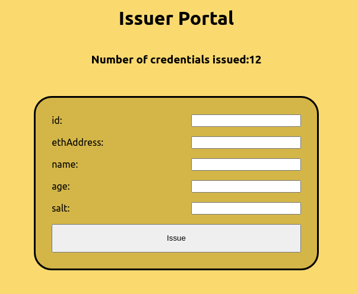
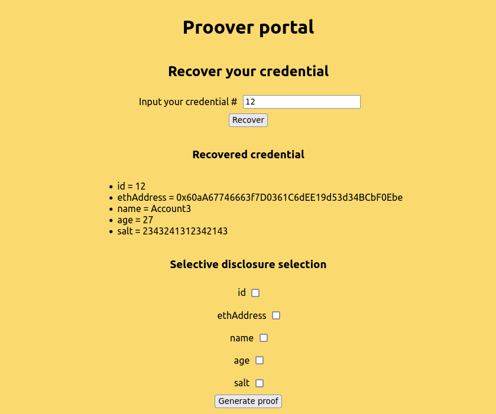
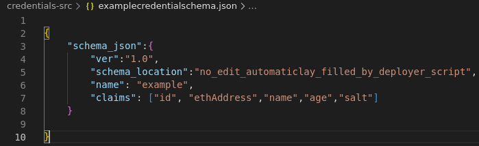
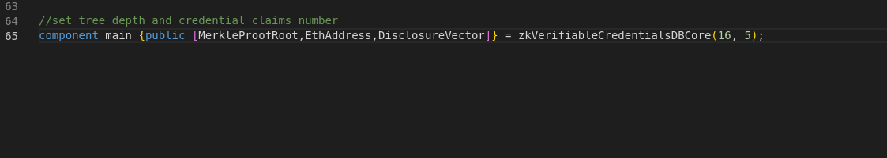
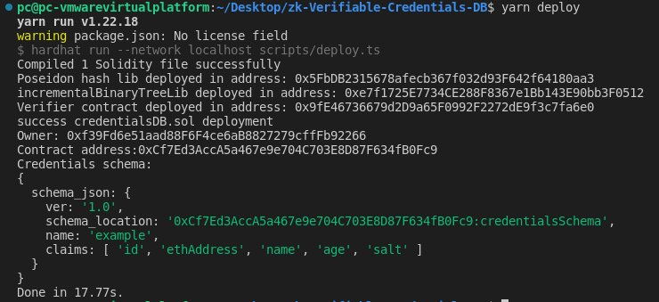
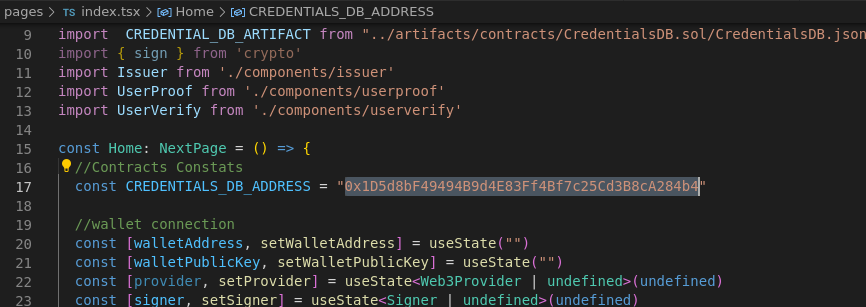

# zk-Verifiable-Credentials-DB

A credentials database encrypted and stored on chain with zk mechanics.

This tool allows to an issuer to create a database to store credentials issued over subjects, and have these credentials always accessible and
untampered thanks to immutable proprieties of the blockchain. Also, a zk verification is implemented to allow the subjects to prove their credentials with selective disclosure of inner claims. This project assumes that subjects are in possession of an eth EOA used as a Self-sovereign identity ID.

### Use Cases
* Zero knowledge membership proof.
* Persistent credentials registers.
* Zero knowledge selective disclosure of the claims inside of a credential.

### System Players
* Issuer: it is the account which owns the contract and can issue new credentials.
* User proover: A user that holds a specific credential and can generate a proof of that possession.
* User verifier: A user that verifies the proof.

### Application overview

The application consists of a front-end built using Next.js, and two contracts that have to be deployed in an EVM blockchain. Tools like circom, snarkjs and zk-kit have been used to implement zk mechanics.

The first contract is CredentialsDB.sol, this contract contains a register with encrypted credentials and a Merkle Tree. The register is used to guarantee the credential availability to the users since all credentials are public accesible. Nevertheless, they are encrypted with users public key. The Merkle Tree is used to hold leaves that represents credentials.

The second contract is a verifier that is autogenerated using snarkjs library. The circuit from which the verifier contract is generated is circuits/zkVerifiableCredentialsDBCore.circom.

Another component of the system is the frontend app. Through the app we can interact with on chain contracts to issue new credentials if we are a issuer and to proof and validate credentials if we are a user. The app detects if you are a issuer and shows a different menu.

#### Issuer

 

#### User Proover

 

#### User Verifier

 

### Test instance

You can check an instance of the app deployed in harmony devnet for test purposes.

Frontend: [https://zk-verifiable-credentials.surge.sh/](https://zk-verifiable-credentials.surge.sh/)

Issuer private key: "0d065b1a5dc3f5e336f20b51e7c0cca40bcffe17b64d9e01a0fa0a2188d1904a"

## Deploy an instance

1. Modify the example credential schema credentials-src/examplecredentialschema.json. The schema is a JSON file that defines the claims of a credentials set.

 

2. Modify circuits/zkVerifiableCredentialsDBCore.circom, set "depth" and "claimsN" parameters. "depth" is the depth of the Merkle Tree, this value is related to the total credentials that can be issued (total credentials = 2^depth). If we set a deeper Merkle Tree, circom compilation will output more constraints and we will need a bigger Ptau file to build SNARK setup ([Check available Ptau files](https://github.com/iden3/snarkjs#7-prepare-phase-2)). The "clamisN" parameter has to correspond with the length of the claims array in the schema. Below an example where i set depth=16 and claimsN=5 is shown.

 

3. Set same TREE_DEPTH in the credentialsDB.sol.

4. Compile circuit using `yarn compilecircuit` or running `scripts/compile-circuit.sh` script. Here we can modify the script to select the Ptau file if the compilation of the circuit has to many constraits.

5. Run bump solidity script using `yarn bumpsolidityverifier` or `node scripts/compile-circuit.sh`.

6. Now you have to deploy the contracts, use `yarn deploy` to deploy it in the hardhat local network (you should have it running) or setup a custom network in hardhat.config.ts and use `npm hardhat run --network "custom network" scripts/deploy.ts`.

 

7. Finally you have to take the "Contract address" shown in the deployment log, set it in page/index.tsx file, and build and deploy de frontend using `yarn deployfront`.

 

